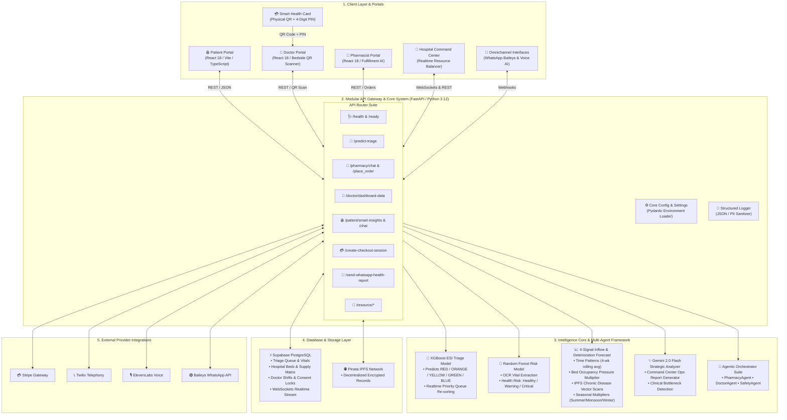

# 🏗️ MyHealthChain — System Architecture Blueprint

This document details the system architecture, component topology, data flows, and design principles of **MyHealthChain (Autonomous Emergency Triage & Real-Time Hospital Command Infrastructure)**.

---

## 📐 High-Level System Architecture Diagram (Mermaid)

---

## 🔍 Layer-by-Layer Architectural Specifications

### Layer 1: Client Portals & Physical Interfaces
* **Patient Portal:** Single-page app (React 18, Vite, TypeScript, TailwindCSS) providing vitals tracking, Gemini document OCR, prescription ordering, IPFS medical record management, and granular doctor consent controls.
* **Doctor Portal:** Bedside interface allowing physicians to inspect emergency patient queues sorted by urgency score, scan physical Smart Health Cards, verify 4-digit PIN access, decrypt IPFS records, and issue digital prescriptions.
* **Pharmacist Portal:** Prescription fulfillment dashboard featuring real-time stock management, Pharmacist AI drug-drug interaction checker, and Stripe payment processing.
* **Hospital Command Center:** Flagship real-time operations dashboard featuring live ESI triage queue monitors (RED, ORANGE, YELLOW, GREEN, BLUE), bed occupancy matrix (ICU, Trauma, ER, General), critical supply trackers (ventilators, oxygen, blood bank), +1h/+4h patient influx predictive ML forecasts, and Gemini strategic command analytics.
* **Smart Health Card (Physical QR + PIN):** Offline-to-online emergency authentication mechanism mapping physical cards to encrypted IPFS records. Requires 4-digit PIN verification.
* **Omnichannel Access (WhatsApp & Voice):** Node.js Baileys API gateway for automated doctor shift alerts and PDF health report dispatches; Twilio + ElevenLabs for phone-line voice AI assistance.

---

### Layer 2: API Gateway & Core Architecture
* **FastAPI Backend Core (`main.py`):** High-performance asynchronous Python 3.12 backend.
* **Centralized Configuration (`core/config.py`):** Pydantic-based settings manager that loads environment variables, validates configuration, and toggles active modes (`development`, `testing`, `production`).
* **Structured Logger (`core/logger.py`):** Centralized JSON logger with ISO 8601 timestamps, log levels, event tracking, correlation IDs, and automated PII/credential sanitization.
* **Modular Router Suite:**
  - `routes/health.py`: `/health` and `/ready` diagnostic probes.
  - `routes/triage.py`: `/predict-triage` ESI ML classification.
  - `routes/pharmacy.py`: `/pharmacy/chat`, `/place_order`, and order management.
  - `routes/doctor.py`: `/doctor/dashboard-data` and consent views.
  - `routes/patient.py`: `/patient/smart-insights` and AI symptom chat.
  - `routes/payment.py`: `/create-checkout-session` Stripe links.
  - `routes/whatsapp.py`: `/send-whatsapp-health-report`.
  - `resource_load.py`: `/resource/*` bed occupancy & forecasting.

---

### Layer 3: Artificial Intelligence & Machine Learning Pipeline
1. **XGBoost ESI Triage Classifier (`ml_triage.py`):** Evaluates systolic BP, diastolic BP, heart rate, SpO2, body temperature, age, and chief complaint to predict Emergency Severity Index (ESI 1–5 / RED to BLUE) in < 5 ms.
2. **Random Forest Chronic Risk Engine (`ml_engine.py`):** Combines RegEx document OCR parsing with Random Forest classification to categorize patient health risk (**Healthy**, **Warning**, **Critical**).
3. **4-Signal Inflow & Deterioration Forecast Engine (`resource_load.py`):**
   - *Signal 1:* 4-Week Rolling Time-Series Trend
   - *Signal 2:* Bed Occupancy Pressure Multiplier
   - *Signal 3:* IPFS Chronic Disease Vector Scans
   - *Signal 4:* Seasonal Weather Multipliers (Summer 1.05x, Monsoon 1.15x, Winter 1.10x)
4. **Gemini 2.0 Flash Strategic Analyzer (`ai_config.py`):** Generates executive command summaries, detects operational bottlenecks, and suggests automated resource transfers between regional wards.
5. **Agentic Orchestrator Suite (`agents/`):** Multi-agent framework (`PharmacyAgent`, `DoctorAgent`, `HealthAgent`, `SafetyAgent`, `PrescriptionAgent`) coordinating multi-turn tool calling and safety validation.

---

### Layer 4: Storage & Realtime Data Layer
* **Supabase PostgreSQL:** Cloud database managing `triage_queue`, `hospital_beds`, `medical_resources`, `doctors_shifts`, `load_snapshots`, `ipfs_document_chunks`, and `patient_consents`.
* **Realtime WebSockets:** Live event streaming updating all client terminals instantly when patient priority changes or beds are assigned.
* **Pinata IPFS Network:** Decentralized storage for encrypted medical documents, preventing unauthorized central data leaks.

---

## 🛡️ Clinical Governance & Safety Boundaries

1. **Decision Support Designation:** All AI/ML outputs carry explicit labels: `AI-Assisted Assessment — Requires Clinician Confirmation`.
2. **Authoritative Clinician Control:** Physicians retain full manual override authority to reclassify ESI triage priority levels or alter prescriptions.
3. **Graceful Fallbacks:** If external AI or database services are unconfigured or offline, the system degrades gracefully into deterministic clinical rule-sets and local test modes without crashing.
