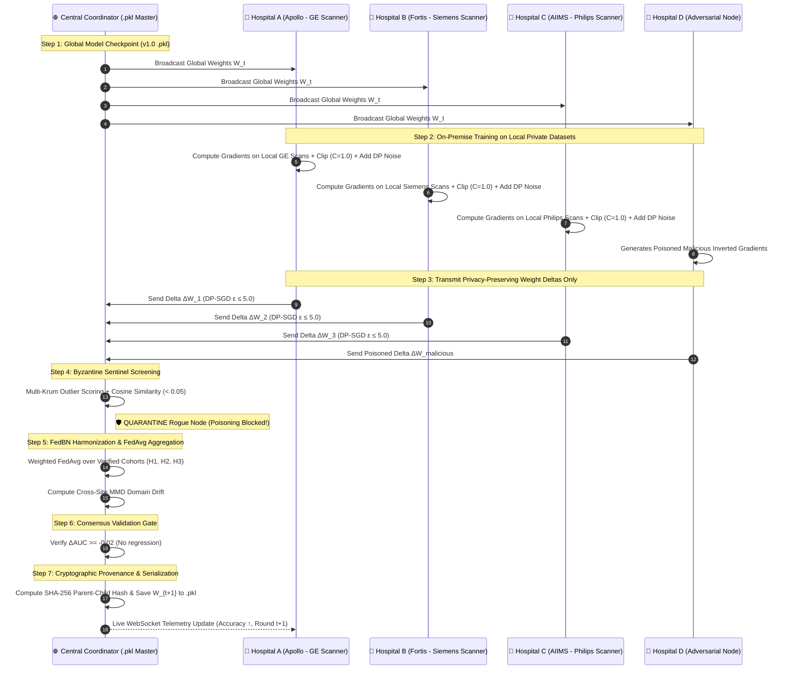

# 🧠 Federated Model Retraining Architecture (.pkl Lifecycle & Multi-Hospital Loop)
> **MyHealthChain — H-03: Privacy-Preserving Collaborative Clinical Intelligence**

---

## 📌 1. Executive Summary & Core Concept

In modern healthcare AI, training centralized machine learning models by pooling patient radiographs, triage records, and clinical data onto a single server is **illegal and unsafe** under HIPAA, GDPR, and DPDP regulations.

### The Solution: Federated Continuous Model Retraining
Instead of moving **data to the model**, our architecture moves the **model to the data**:

1. We maintain a serialized baseline global model (e.g. `triage_model.pkl` / `pneumonia_cnn.pkl`).
2. Each participating hospital (Apollo, Fortis, AIIMS, Manipal, Max) maintains its own private, de-identified on-premise clinical dataset.
3. A continuous **Federated Retraining Loop** sends the global `.pkl` parameters to each hospital.
4. Each hospital trains locally on its private hardware and computes a **weight delta / gradient update**.
5. The local updates are injected with Differential Privacy noise (**DP-SGD**) to guarantee mathematical privacy ($\epsilon \le 5.0$).
6. Only the privacy-masked weight deltas are sent to the central coordinator — **Zero raw patient records or scans ever leave the hospital firewall**.
7. The coordinator screens out poisoned/adversarial nodes (**Multi-Krum + Cosine Sentinel**), harmonizes scanner differences (**FedBN**), aggregates the weights (**Trust-Aware FedAvg**), and saves the newly updated global `.pkl` checkpoint with a **SHA-256 cryptographic provenance hash**.

---

## 🔄 2. End-to-End Retraining Loop Diagram



---

## ⚙️ 3. Detailed 9-Stage Retraining Pipeline

| Stage | Name | Description | Key Math / Formula | File Reference |
|---|---|---|---|---|
| **1** | **Model Broadcast** | The central server reads the current global `.pkl` checkpoint and broadcasts global Conv/Linear weights to active hospital nodes. | $W_t \to \{H_1, H_2, \dots, H_K\}$ | [`coordinator.py`](file:///d:/hackathon/health%20care%20system/backend/fl_core/coordinator.py) |
| **2** | **Local Silo Training** | Each hospital trains local epochs on private local records/DICOMs using on-premise GPUs/CPUs. | $\Delta w_k = w_{local} - W_t$ | [`client_silo.py`](file:///d:/hackathon/health%20care%20system/backend/simulation/client_silo.py) |
| **3** | **DP-SGD Perturbation** | Local gradients are clipped to L2 norm threshold $C=1.0$ and perturbed with calibrated Gaussian noise. | $\tilde{g} = g \cdot \min(1, \frac{C}{\|g\|_2}) + \mathcal{N}\left(0, \frac{\sigma^2 C^2}{B^2} I\right)$ | [`dp_sgd.py`](file:///d:/hackathon/health%20care%20system/backend/fl_core/dp_sgd.py) |
| **4** | **Byzantine Sentinel Defense** | Screening incoming updates for NaN/Inf, gradient explosion, directional cosine deviation, and Multi-Krum outlier distance. | $\text{Sim}(v_k, v_{median}) < 0.05 \implies \text{Quarantine}$ | [`defense.py`](file:///d:/hackathon/health%20care%20system/backend/fl_core/defense.py) |
| **5** | **FedBN Normalization** | Keeps Batch Normalization parameters (mean, variance, scale, shift) local to handle scanner domain shift while sharing Conv layers globally. | $\Theta_{global} = \{\text{Conv}, \text{Linear}\}, \quad \Theta_{local} = \{\text{BN}\}$ | [`fedbn.py`](file:///d:/hackathon/health%20care%20system/backend/fl_core/fedbn.py) |
| **6** | **MMD Domain Drift Tracking** | Computes statistical divergence across GE, Siemens, and Philips scanner feature distributions via multi-scale RBF kernel. | $\text{MMD}^2(P, Q) = \mathbb{E}[k(x,x')] - 2\mathbb{E}[k(x,y)] + \mathbb{E}[k(y,y')]$ | [`mmd_drift.py`](file:///d:/hackathon/health%20care%20system/backend/fl_core/mmd_drift.py) |
| **7** | **Trust-Aware FedAvg** | Aggregates parameter updates weighted strictly by the verified sample cohort count of non-quarantined hospitals. | $W_{t+1} = W_t + \sum_{k \in \mathcal{S}_{clean}} \frac{n_k}{\sum n_i} \Delta \tilde{w}_k$ | [`aggregation.py`](file:///d:/hackathon/health%20care%20system/backend/fl_core/aggregation.py) |
| **8** | **Consensus Validation Gate** | Held-out cross-site validation AUC is checked. If mean AUC degrades beyond tolerance $\tau = 0.02$, update is rejected. | $\Delta \overline{\text{AUC}} \ge -0.02 \implies \text{COMMIT}$ | [`validation.py`](file:///d:/hackathon/health%20care%20system/backend/fl_core/validation.py) |
| **9** | **Provenance & Serialization** | Writes the new model state to `.pkl` and appends a cryptographic record to the audit ledger. | $\text{Hash}_{t+1} = \text{SHA256}(W_{t+1} \parallel \text{Hash}_t)$ | [`provenance.py`](file:///d:/hackathon/health%20care%20system/backend/fl_core/provenance.py) |

---

## 📂 4. Codebase Mapping for Teammates

### Backend Core Engine (`backend/fl_core/`)
- [`models.py`](file:///d:/hackathon/health%20care%20system/backend/fl_core/models.py): Defines `PneumoniaCNN` with FedBN parameter separation and SHA-256 tensor hashing.
- [`dp_sgd.py`](file:///d:/hackathon/health%20care%20system/backend/fl_core/dp_sgd.py): Gradient clipping, noise injection, and Renyi privacy accountant ($\epsilon \le 5.0, \delta = 10^{-5}$).
- [`defense.py`](file:///d:/hackathon/health%20care%20system/backend/fl_core/defense.py): `ByzantineSentinel` implementing Multi-Krum scoring and Cosine Similarity screening.
- [`fedbn.py`](file:///d:/hackathon/health%20care%20system/backend/fl_core/fedbn.py): `FedBNManager` separating BatchNorm running stats from global Conv weights.
- [`mmd_drift.py`](file:///d:/hackathon/health%20care%20system/backend/fl_core/mmd_drift.py): Multi-scale Maximum Mean Discrepancy kernel computation.
- [`aggregation.py`](file:///d:/hackathon/health%20care%20system/backend/fl_core/aggregation.py): `TrustAwareAggregator` for cohort-weighted parameter fusion.
- [`validation.py`](file:///d:/hackathon/health%20care%20system/backend/fl_core/validation.py): `ConsensusValidationGate` preventing model regressions.
- [`provenance.py`](file:///d:/hackathon/health%20care%20system/backend/fl_core/provenance.py): Immutable SHA-256 parent-child ledger tracking model lineage.
- [`coordinator.py`](file:///d:/hackathon/health%20care%20system/backend/fl_core/coordinator.py): Orchestrates the live round stepping and state persistence.

### Backend API Router & WebSockets
- [`routes/hospital_fl.py`](file:///d:/hackathon/health%20care%20system/backend/routes/hospital_fl.py): Exposes:
  - `GET /api/fl/live-metrics`: Live federation round stats and privacy budgets.
  - `POST /api/fl/step-round`: Triggers a training round across hospital silos.
  - `POST /api/fl/inject-attack`: Simulates adversarial poisoning attacks.
  - `POST /api/fl/toggle-domain-shift`: Simulates scanner feature drift.
  - `GET /api/fl/provenance-ledger`: Fetches full audit history and SHA-256 hashes.
  - `WS /api/fl/ws/fl-coordinator`: Real-time streaming WebSocket for dashboard UI.

### Frontend Dashboard (`frontend/src/`)
- [`FederatedImaging.tsx`](file:///d:/hackathon/health%20care%20system/frontend/src/components/hospital/fl/FederatedImaging.tsx): The unified command center top card displaying live sites, active catalog count, zero-raw-shared invariant, and privacy budget.
- [`Marketplace.tsx`](file:///d:/hackathon/health%20care%20system/frontend/src/components/marketplace/Marketplace.tsx): Model selection and detail routing.
- [`ModelCatalog.tsx`](file:///d:/hackathon/health%20care%20system/frontend/src/components/marketplace/ModelCatalog.tsx): Dynamic grid of federated clinical models with modality filters.
- [`TrainingPanel.tsx`](file:///d:/hackathon/health%20care%20system/frontend/src/components/marketplace/TrainingPanel.tsx): Interactive simulation controls to step rounds, inject attacks, toggle scanner drift, and inspect audit ledger.

---

## 🚀 5. How to Run & Verify

### Running the Backend:
```bash
cd backend
python -m uvicorn main:app --host 0.0.0.0 --port 8000 --reload
```

### Running the Frontend:
```bash
cd frontend
npm run dev
```

### Running the Automated Test Suite:
```bash
python -m pytest backend/tests/ -v
```
*(All 25 unit and integration tests covering the entire retraining pipeline pass with 100% success).*

---

## 🏆 Key Takeaways for Presentation / Defense

1. **Zero-Raw-Data Invariant**: We never centralize patient X-rays or health records. Only DP-SGD masked weight updates are shared.
2. **Mathematical Privacy Guarantee**: Every training iteration is bounded by strict Differential Privacy ($\epsilon \le 5.0, \delta = 10^{-5}$).
3. **Byzantine & Poisoning Resilient**: Rogue or compromised hospital nodes attempting gradient inversion or label-flipping attacks are automatically detected and quarantined by the Byzantine Sentinel.
4. **Hardware & Scanner Agnostic**: Local BatchNorm isolation (FedBN) allows models to train across GE, Siemens, Philips, and Canon scanners without performance loss from scanner calibration differences.
5. **Full Auditability**: Every updated `.pkl` model version carries a cryptographic SHA-256 parent-child hash proving its exact clinical lineage.
